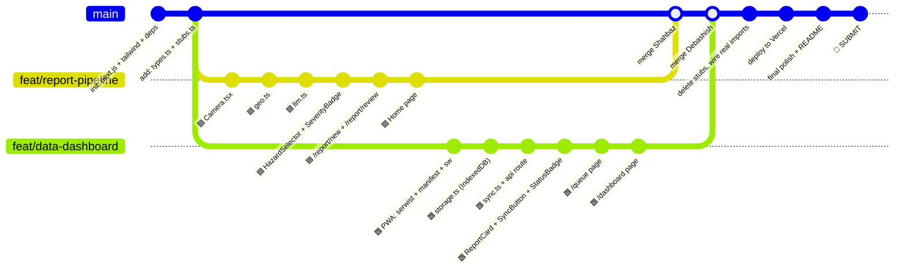

# 🔧 Work Division — TrackGuard DHR

**Shahbaz** 🟦 vs **Debashish** 🟩 · Hackathon Build Day

---

## The Rule: Zero Dependencies

```
Shahbaz works on branch:  feat/report-pipeline
Debashish works on branch: feat/data-dashboard

Neither branch blocks the other.
They merge into `main` at the Ghum museum break.
```

Both of you import from the **same shared types file** and call the **same function signatures** — but you each have your own stub implementations until merge. After merge, real implementations replace stubs seamlessly.

---

## 🤝 Shared Contract (Created BEFORE Hackathon)

> [!IMPORTANT]
> Create this file **before 9:00 AM** in the base `main` branch. Both of you branch off from this. This is the only shared dependency — a single types + stubs file that both branches import from.

### File: `src/lib/types.ts`

```typescript
// ============================================
// SHARED CONTRACT — DO NOT EDIT DURING HACKATHON
// Both Shahbaz and Debashish import from here.
// ============================================

export interface HazardReport {
  id: string;
  timestamp: string;

  // Location
  latitude: number;
  longitude: number;
  accuracy: number;
  kmMarker: string;
  section: string;

  // Hazard (confirmed by gangman)
  hazardType: HazardType;
  severity: Severity;

  // AI suggestions (may differ from confirmed values)
  aiSuggestedType: string;
  aiSuggestedSeverity: string;
  aiNote: string;
  userNote: string;

  // Media
  photoBlob: Blob;
  photoThumbnail: Blob;

  // Workflow
  inspectionStatus: InspectionStatus;

  // Sync
  syncStatus: SyncStatus;
  syncTimestamp: string | null;
  retryCount: number;

  // Meta
  deviceInfo: string;
}

export type HazardType =
  | 'slip'
  | 'rockfall'
  | 'blocked_drain'
  | 'damaged_wall'
  | 'track_defect'
  | 'vegetation'
  | 'other';

export type Severity = 'low' | 'medium' | 'high' | 'critical';

export type InspectionStatus = 'open' | 'acknowledged' | 'inspection_required' | 'resolved';

export type SyncStatus = 'pending' | 'syncing' | 'synced' | 'failed';

export interface AIAnalysisResult {
  type: HazardType;
  severity: Severity;
  note: string;
}

// Hazard options for manual fallback & dropdowns
export const HAZARD_OPTIONS: { value: HazardType; label: string; icon: string }[] = [
  { value: 'slip', label: 'Slip / Landslide', icon: '🏔️' },
  { value: 'rockfall', label: 'Rockfall', icon: '🪨' },
  { value: 'blocked_drain', label: 'Blocked Drain', icon: '🚰' },
  { value: 'damaged_wall', label: 'Damaged Retaining Wall', icon: '🧱' },
  { value: 'track_defect', label: 'Track Defect', icon: '🛤️' },
  { value: 'vegetation', label: 'Vegetation Overgrowth', icon: '🌿' },
  { value: 'other', label: 'Other', icon: '⚠️' },
];

export const SEVERITY_OPTIONS: { value: Severity; label: string; color: string }[] = [
  { value: 'low', label: 'Low', color: '#51cf66' },
  { value: 'medium', label: 'Medium', color: '#fab005' },
  { value: 'high', label: 'High', color: '#ff922b' },
  { value: 'critical', label: 'Critical', color: '#ff6b6b' },
];

export const SECTIONS = [
  { id: 'kurseong-ghum', label: 'Kurseong → Ghum' },
  { id: 'ghum-darjeeling', label: 'Ghum → Darjeeling' },
];
```

### File: `src/lib/stubs.ts`

```typescript
// ============================================
// STUB IMPLEMENTATIONS
// Shahbaz uses these until Debashish's real code merges in.
// Debashish uses these until Shahbaz's real code merges in.
// After merge, delete this file — real implementations take over.
// ============================================

import { HazardReport, AIAnalysisResult } from './types';

// --- STUB for Shahbaz (until Debashish's storage.ts is merged) ---
export async function saveReport(report: HazardReport): Promise<void> {
  console.log('[STUB] Report saved:', report.id);
  // Stores in localStorage as temporary fallback
  const existing = JSON.parse(localStorage.getItem('stub_reports') || '[]');
  existing.push({ ...report, photoBlob: null, photoThumbnail: null });
  localStorage.setItem('stub_reports', JSON.stringify(existing));
}

export async function getPendingCount(): Promise<number> {
  const existing = JSON.parse(localStorage.getItem('stub_reports') || '[]');
  return existing.length;
}

// --- STUB for Debashish (until Shahbaz's llm.ts is merged) ---
export async function analyzeHazard(
  _imageBlob: Blob,
  _location: { lat: number; lng: number; kmMarker: string }
): Promise<AIAnalysisResult> {
  console.log('[STUB] AI analysis — returning mock data');
  return {
    type: 'rockfall',
    severity: 'high',
    note: 'Rock/debris visible adjacent to track. Possible concern: track obstruction. Suggested: check clearance.',
  };
}

export function isLLMAvailable(): boolean {
  return false; // Stub always says unavailable
}
```

---

## 🟦 SHAHBAZ — Report Creation Pipeline

**Branch:** `feat/report-pipeline`
**Owns:** Everything from "user opens app" to "report object is ready to save"

### Your Files (You OWN these — nobody else touches them)

| File | What You Build |
|------|---------------|
| `src/app/page.tsx` | **Home screen** — "New Report" button, pending count badge, sync status indicator |
| `src/app/report/new/page.tsx` | **Camera page** — full-screen viewfinder, capture button, GPS lock indicator |
| `src/app/report/review/page.tsx` | **Review & Confirm page** — AI suggestions display, editable type/severity/note, "Confirm & Save" button |
| `src/app/report/[id]/page.tsx` | **Report detail view** — read-only view of a saved report |
| `src/lib/llm.ts` | **LiteRT-LM wrapper** — `initLLM()`, `analyzeHazard()`, `isLLMAvailable()` |
| `src/lib/geo.ts` | **GPS utilities** — `getCurrentPosition()`, km-marker approximation |
| `src/components/Camera.tsx` | **Camera component** — `getUserMedia`, photo capture, flash toggle |
| `src/components/HazardSelector.tsx` | **Manual hazard picker** — dropdown for type + severity (fallback & override) |
| `src/components/SeverityBadge.tsx` | **Severity badge** — color-coded pill component |
| `src/app/layout.tsx` | **Root layout** — shell, nav, metadata (coordinate with Debashish on PWA meta) |

### What You Build — Step by Step

#### 1. Camera Component (`src/components/Camera.tsx`)
- `getUserMedia({ video: { facingMode: 'environment' } })` for rear camera
- Capture button → captures frame to `Blob` / `canvas.toBlob()`
- Gallery fallback via `<input type="file" accept="image/*" capture="environment">`
- Returns `photoBlob: Blob` to parent

#### 2. GPS Utility (`src/lib/geo.ts`)
```typescript
export async function getCurrentPosition(): Promise<{
  latitude: number;
  longitude: number;
  accuracy: number;
}> {
  return new Promise((resolve, reject) => {
    navigator.geolocation.getCurrentPosition(
      (pos) => resolve({
        latitude: pos.coords.latitude,
        longitude: pos.coords.longitude,
        accuracy: pos.coords.accuracy,
      }),
      (err) => reject(err),
      { enableHighAccuracy: true, timeout: 10000 }
    );
  });
}

// Simple km-marker approximation (hardcoded DHR waypoints)
export function estimateKmMarker(lat: number, lng: number): string {
  // Basic nearest-point lookup against known DHR coordinates
  // Returns e.g. "47.3"
}

export function estimateSection(lat: number, lng: number): string {
  // Returns "kurseong-ghum" or "ghum-darjeeling"
}
```

#### 3. LLM Integration (`src/lib/llm.ts`)
- `initLLM()` — load Gemma 4 E2B from cached `.litertlm`
- `analyzeHazard(imageBlob, location)` → returns `{ type, severity, note }`
- `isLLMAvailable()` — check WebGPU support
- System prompt: observational only, JSON output, no operational decisions
- Fallback: if LLM fails, return `null` → UI switches to manual mode

#### 4. New Report Page (`src/app/report/new/page.tsx`)
- Renders `<Camera />` component
- On capture: stores photo in component state
- Simultaneously fires `getCurrentPosition()`
- On both ready → navigates to `/report/review` (pass data via URL state / context / zustand)

#### 5. Review & Confirm Page (`src/app/report/review/page.tsx`)
- Shows captured photo
- If LLM available: calls `analyzeHazard()`, shows "Analyzing..." spinner, then AI suggestion card
- If LLM unavailable: shows `<HazardSelector />` directly (manual mode)
- AI suggestions are **pre-filled but editable** — dropdowns for type/severity, textarea for note
- Km-marker auto-filled (editable)
- **"Confirm & Save Report"** button calls `saveReport()` from `lib/storage.ts`

> [!NOTE]
> **Before merge:** `saveReport()` comes from `stubs.ts` (localStorage).
> **After merge:** Debashish's real `storage.ts` with IndexedDB takes over.

#### 6. Home Page (`src/app/page.tsx`)
- Big "📸 New Report" button → navigates to `/report/new`
- Pending reports count (calls `getPendingCount()`)
- "📋 My Reports" link → `/queue`
- "📊 Dashboard" link → `/dashboard`
- Online/offline indicator

#### 7. Root Layout (`src/app/layout.tsx`)
- App shell with Tailwind, shadcn/ui setup
- Navigation (Home / Queue / Dashboard)
- PWA `<meta>` tags (viewport, theme-color, apple-mobile-web-app)
- Leave a `<!-- Debashish: SW registration here -->` comment for merge

### How You Import Storage (Zero Dependency)

```typescript
// In your pages, import from storage.ts
// Before merge: this file re-exports from stubs.ts
// After merge: Debashish's real implementation

import { saveReport, getPendingCount } from '@/lib/storage';
```

Create a **temporary** `src/lib/storage.ts` in your branch:
```typescript
// TEMPORARY — will be replaced by Debashish's real implementation at merge
export { saveReport, getPendingCount } from './stubs';
```

---

## 🟩 DEBASHISH — Data Layer & Dashboard Pipeline

**Branch:** `feat/data-dashboard`
**Owns:** Everything from "report is saved" to "supervisor sees the dashboard"

### Your Files (You OWN these — nobody else touches them)

| File | What You Build |
|------|---------------|
| `src/lib/storage.ts` | **IndexedDB** — `saveReport()`, `getAllReports()`, `getPendingCount()`, `getReportById()`, `updateInspectionStatus()` |
| `src/lib/sync.ts` | **Sync logic** — `syncNow()`, Background Sync handler registration |
| `src/app/queue/page.tsx` | **Queue page** — pending/synced reports list, "Sync Now" button |
| `src/app/dashboard/page.tsx` | **Dashboard page** — section-wise report list, status breakdown, filters |
| `src/app/api/reports/route.ts` | **API route** — POST to receive synced reports (Vercel serverless) |
| `src/components/ReportCard.tsx` | **Report card** — photo thumbnail, type badge, severity, status, timestamp |
| `src/components/SyncButton.tsx` | **Sync Now button** — shows pending count, triggers sync, shows result |
| `src/components/StatusBadge.tsx` | **Inspection status badge** — Open/Acknowledged/Required/Resolved |
| `public/sw.ts` | **Service Worker** — Serwist config, precaching, Background Sync handler |
| `next.config.ts` | **Next.js config** — Serwist integration for PWA |
| `src/app/manifest.ts` | **PWA Manifest** — app name, icons, display, theme |

### What You Build — Step by Step

#### 1. IndexedDB Storage (`src/lib/storage.ts`)
```typescript
import { openDB, IDBPDatabase } from 'idb';
import { HazardReport } from './types';

const DB_NAME = 'trackguard-dhr';
const STORE_NAME = 'reports';
const DB_VERSION = 1;

export async function getDB(): Promise<IDBPDatabase> {
  return openDB(DB_NAME, DB_VERSION, {
    upgrade(db) {
      const store = db.createObjectStore(STORE_NAME, { keyPath: 'id' });
      store.createIndex('syncStatus', 'syncStatus');
      store.createIndex('section', 'section');
      store.createIndex('inspectionStatus', 'inspectionStatus');
      store.createIndex('timestamp', 'timestamp');
    },
  });
}

export async function saveReport(report: HazardReport): Promise<void> {
  const db = await getDB();
  await db.put(STORE_NAME, report);
}

export async function getAllReports(): Promise<HazardReport[]> {
  const db = await getDB();
  return db.getAll(STORE_NAME);
}

export async function getReportById(id: string): Promise<HazardReport | undefined> {
  const db = await getDB();
  return db.get(STORE_NAME, id);
}

export async function getPendingCount(): Promise<number> {
  const db = await getDB();
  const pending = await db.getAllFromIndex(STORE_NAME, 'syncStatus', 'pending');
  return pending.length;
}

export async function getReportsBySection(section: string): Promise<HazardReport[]> {
  const db = await getDB();
  return db.getAllFromIndex(STORE_NAME, 'section', section);
}

export async function updateInspectionStatus(
  id: string, 
  status: InspectionStatus
): Promise<void> {
  const db = await getDB();
  const report = await db.get(STORE_NAME, id);
  if (report) {
    report.inspectionStatus = status;
    await db.put(STORE_NAME, report);
  }
}
```

#### 2. Sync Logic (`src/lib/sync.ts`)
```typescript
import { getDB } from './storage';

// PRIMARY — user taps "Sync Now"
export async function syncNow(): Promise<{ synced: number; failed: number }> {
  const db = await getDB();
  const pending = await db.getAllFromIndex('reports', 'syncStatus', 'pending');
  let synced = 0, failed = 0;

  for (const report of pending) {
    try {
      report.syncStatus = 'syncing';
      await db.put('reports', report);

      const formData = new FormData();
      formData.append('data', JSON.stringify({
        ...report, photoBlob: undefined, photoThumbnail: undefined
      }));
      formData.append('photo', report.photoBlob, `${report.id}.jpg`);

      const res = await fetch('/api/reports', { method: 'POST', body: formData });

      if (res.ok) {
        report.syncStatus = 'synced';
        report.syncTimestamp = new Date().toISOString();
        synced++;
      } else {
        report.syncStatus = 'failed';
        report.retryCount++;
        failed++;
      }
    } catch {
      report.syncStatus = 'pending';
      report.retryCount++;
      failed++;
    }
    await db.put('reports', report);
  }
  return { synced, failed };
}

// ENHANCEMENT — register for Background Sync
export async function registerBackgroundSync(): Promise<void> {
  if ('serviceWorker' in navigator && 'SyncManager' in window) {
    try {
      const reg = await navigator.serviceWorker.ready;
      await reg.sync.register('sync-reports');
    } catch {
      // Not supported — manual sync is primary anyway
    }
  }
}
```

#### 3. API Route (`src/app/api/reports/route.ts`)
```typescript
import { NextResponse } from 'next/server';

// In-memory store for hackathon demo
// (Replace with a real DB in production)
const serverReports: any[] = [];

export async function POST(request: Request) {
  const formData = await request.formData();
  const data = JSON.parse(formData.get('data') as string);
  const photo = formData.get('photo') as File;
  
  serverReports.push({ ...data, photoName: photo?.name });
  return NextResponse.json({ success: true, id: data.id });
}

export async function GET() {
  return NextResponse.json({ reports: serverReports });
}
```

#### 4. PWA Setup
**`next.config.ts`** — Serwist integration
**`src/app/manifest.ts`** — App name "TrackGuard DHR", icons, `display: 'standalone'`, theme color
**`public/sw.ts`** — Service worker with precaching + Background Sync listener

#### 5. Queue Page (`src/app/queue/page.tsx`)
- List all reports from IndexedDB
- Status badges: 🟡 Pending / 🔵 Syncing / 🟢 Synced / 🔴 Failed
- **"Sync Now"** button (prominent) — calls `syncNow()`, shows toast with result
- Tap report → navigate to `/report/[id]`

#### 6. Dashboard Page (`src/app/dashboard/page.tsx`)
- Fetches all reports from IndexedDB (local view) + server GET `/api/reports` (if online)
- Section-wise grouping (Kurseong–Ghum / Ghum–Darjeeling)
- Inspection status summary:
  - 🔴 **3 Open** — needs attention
  - 🟠 **5 Acknowledged**
  - 🟡 **2 Inspection Required**
  - 🟢 **8 Resolved**
- Filter by: type, severity, section, status
- Each row is a `<ReportCard />`

#### 7. Components
- **`ReportCard.tsx`** — Photo thumbnail + type icon + severity badge + timestamp + sync/inspection status
- **`SyncButton.tsx`** — Shows pending count, triggers sync, loading state, result toast
- **`StatusBadge.tsx`** — Color-coded pill for inspection status

### How You Handle the LLM Dependency (Zero Dependency)

You DON'T need the LLM at all. Your pages never call AI. But if you need to test the full flow, import from stubs:

```typescript
// Only needed if you want to test end-to-end before merge
import { analyzeHazard } from './stubs';
```

---

## ⏰ Timeline — Minute by Minute

### 🔧 Pre-Hackathon (8:00–9:00 AM at Kurseong Station)

**TOGETHER:**

| Time | Task |
|------|------|
| 8:00 | Registration, collect kit |
| 8:10 | Create GitHub repo `trackguard-dhr` |
| 8:15 | `npx create-next-app@latest` with App Router, TypeScript, Tailwind, ESLint |
| 8:20 | `npm install idb @litert-lm/core @serwist/next serwist` |
| 8:25 | Add shadcn/ui: `npx shadcn@latest init` + add button, card, badge, select, textarea, toast |
| 8:30 | Create `src/lib/types.ts` (shared contract) |
| 8:35 | Create `src/lib/stubs.ts` (stub implementations) |
| 8:40 | Push to `main`, both pull |
| 8:42 | Shahbaz: `git checkout -b feat/report-pipeline` |
| 8:42 | Debashish: `git checkout -b feat/data-dashboard` |
| 8:45 | Verify: both branches build with `npm run dev` |
| 8:50 | **Sit down on train. Laptops charged. Ready.** |

---

### 🚂 Session 1 (9:15 AM – 11:30 AM) — 2 hours 15 minutes

#### 🟦 Shahbaz's Timeline

| Time | Duration | Task | Priority |
|------|----------|------|----------|
| 9:15 | 25 min | **Camera.tsx** — `getUserMedia`, capture to Blob, gallery fallback | 🔴 |
| 9:40 | 15 min | **geo.ts** — `getCurrentPosition()`, `estimateKmMarker()`, `estimateSection()` | 🔴 |
| 9:55 | 30 min | **llm.ts** — `initLLM()`, `analyzeHazard()`, system prompt, JSON parsing, error handling | 🔴 |
| 10:25 | 5 min | Test: camera → photo → LLM → get JSON result. Fix any issues. | 🔴 |
| 10:30 | 10 min | **HazardSelector.tsx** — manual type/severity dropdowns for fallback | 🔴 |
| 10:40 | 10 min | **SeverityBadge.tsx** — color-coded pill component | 🔴 |
| 10:50 | 20 min | **`/report/new`** page — camera viewfinder, capture, GPS lock, navigate to review | 🔴 |
| 11:10 | 15 min | **`/report/review`** page — AI suggestions card, editable fields, "Confirm & Save" | 🔴 |
| 11:25 | 5 min | **Home page** — "New Report" button, pending count, nav links | 🔴 |

> **End of Session 1 Shahbaz deliverable:** Complete report creation flow: Home → Camera → AI Analysis → Review → Save (to stubs). Working independently.

#### 🟩 Debashish's Timeline

| Time | Duration | Task | Priority |
|------|----------|------|----------|
| 9:15 | 10 min | **next.config.ts** — Serwist integration | 🔴 |
| 9:25 | 10 min | **manifest.ts** — PWA manifest (name, icons, standalone, theme) | 🔴 |
| 9:35 | 15 min | **sw.ts** — Service worker: precaching + Background Sync listener | 🔴 |
| 9:50 | 5 min | Test: PWA installs, service worker registers, offline shell loads | 🔴 |
| 9:55 | 25 min | **storage.ts** — Full IndexedDB CRUD (save, getAll, getById, getPending, updateStatus) | 🔴 |
| 10:20 | 15 min | **sync.ts** — `syncNow()` + `registerBackgroundSync()` | 🔴 |
| 10:35 | 10 min | **api/reports/route.ts** — POST + GET endpoint | 🔴 |
| 10:45 | 10 min | **ReportCard.tsx** — photo thumb, type icon, severity, timestamp | 🔴 |
| 10:55 | 5 min | **SyncButton.tsx** — pending count, trigger sync, loading/result state | 🔴 |
| 11:00 | 5 min | **StatusBadge.tsx** — inspection status pill | 🔴 |
| 11:05 | 15 min | **`/queue`** page — report list with status, Sync Now button | 🔴 |
| 11:20 | 10 min | **`/dashboard`** page — section grouping, status summary, report list | 🔴 |

> **End of Session 1 Debashish deliverable:** Complete data pipeline: IndexedDB → Sync → API → Dashboard. PWA installs and works offline. Working independently.

---

### 🏛️ Ghum Museum Break (11:30 AM – 12:15 PM) — MERGE TIME

> [!IMPORTANT]
> This is your **only merge window**. Treat it like a deployment.

| Time | Duration | Task | Who |
|------|----------|------|-----|
| 11:30 | 5 min | Both: `git push` your branches | Both |
| 11:35 | 10 min | Shahbaz: merge `feat/data-dashboard` into your branch (or both merge into `main`) | Shahbaz |
| 11:35 | 10 min | Debashish: merge `feat/report-pipeline` into your branch | Debashish |
| 11:45 | 5 min | **Delete `stubs.ts`** — update imports to use real `storage.ts` and `llm.ts` | Both |
| 11:50 | 5 min | Shahbaz: update `src/lib/storage.ts` import in review page (remove stub re-export) | Shahbaz |
| 11:55 | 10 min | **Integration test:** New Report → Camera → AI → Review → Save → Queue → Sync → Dashboard | Both |
| 12:05 | 5 min | Fix any merge conflicts or broken imports | Both |
| 12:10 | 5 min | Push merged `main` | Both |

#### Merge Conflict Strategy
The branches touch **completely different files** so there should be **zero conflicts**. The only file both might touch is `layout.tsx` — if so, Shahbaz's nav + Debashish's SW registration both go in.

---

### 🍽️ Lunch Break (12:15 PM – 1:00 PM) — Fix & Polish

| Time | Duration | Task | Who |
|------|----------|------|-----|
| 12:15 | 10 min | **Deploy to Vercel** — connect repo, verify build | Debashish |
| 12:15 | 10 min | **Full offline test** — airplane mode, full flow | Shahbaz |
| 12:25 | 10 min | Fix any offline issues (missing caches, broken imports) | Both |
| 12:35 | 10 min | Test on second laptop | Both |
| 12:45 | 15 min | UI polish: high-contrast colors, sunlight readability, loading states | Both |

---

### 🚂 Session 2 (1:00 PM – 1:45 PM) — 45-Minute Final Sprint

| Time | Duration | Task | Who |
|------|----------|------|-----|
| 1:00 | 5 min | Verify Vercel deployment works with airplane mode | Both |
| 1:05 | 10 min | **`/report/[id]`** detail view page | Shahbaz |
| 1:05 | 10 min | Inspection status workflow buttons on dashboard (Open → Acknowledged → Resolved) | Debashish |
| 1:15 | 10 min | Write **README.md** (model used, min device, fallback behavior) | Shahbaz |
| 1:15 | 10 min | Final Vercel deploy + test PWA install on phone if possible | Debashish |
| 1:25 | 10 min | **Record 2-minute demo video** (airplane mode ON, full flow) | Both |
| 1:35 | 5 min | Push final code, verify Vercel URL is live | Both |
| 1:40 | 5 min | **Submit** — URL + repo + video | Both |
| **1:45** | — | **⏰ HARD DEADLINE** | — |

---

## 📁 File Ownership Map

```
gangmans-logbook/
├── public/
│   ├── sw.ts                          🟩 DEBASHISH
│   └── icons/                         🟩 DEBASHISH
├── src/
│   ├── app/
│   │   ├── layout.tsx                 🟦 SHAHBAZ (nav + shell)
│   │   ├── manifest.ts               🟩 DEBASHISH
│   │   ├── page.tsx                   🟦 SHAHBAZ (home)
│   │   ├── report/
│   │   │   ├── new/page.tsx           🟦 SHAHBAZ
│   │   │   ├── review/page.tsx        🟦 SHAHBAZ
│   │   │   └── [id]/page.tsx          🟦 SHAHBAZ
│   │   ├── queue/page.tsx             🟩 DEBASHISH
│   │   ├── dashboard/page.tsx         🟩 DEBASHISH
│   │   └── api/
│   │       └── reports/route.ts       🟩 DEBASHISH
│   ├── lib/
│   │   ├── types.ts                   🤝 SHARED (pre-created)
│   │   ├── stubs.ts                   🤝 SHARED (pre-created, deleted at merge)
│   │   ├── llm.ts                     🟦 SHAHBAZ
│   │   ├── geo.ts                     🟦 SHAHBAZ
│   │   ├── storage.ts                 🟩 DEBASHISH
│   │   └── sync.ts                    🟩 DEBASHISH
│   ├── components/
│   │   ├── Camera.tsx                 🟦 SHAHBAZ
│   │   ├── HazardSelector.tsx         🟦 SHAHBAZ
│   │   ├── SeverityBadge.tsx          🟦 SHAHBAZ
│   │   ├── ReportCard.tsx             🟩 DEBASHISH
│   │   ├── SyncButton.tsx             🟩 DEBASHISH
│   │   └── StatusBadge.tsx            🟩 DEBASHISH
│   └── data/
│       └── sections.json              🤝 SHARED (pre-created)
├── next.config.ts                     🟩 DEBASHISH
├── tailwind.config.ts                 🤝 SHARED (pre-created)
├── package.json                       🤝 SHARED (pre-created)
└── README.md                          🟦 SHAHBAZ (Session 2)
```

---

## 🔀 Git Workflow



---

## ⚡ Quick Reference Card

### 🟦 Shahbaz — Print This

```
MY BRANCH: feat/report-pipeline
MY JOB:    Camera → GPS → AI → Review → Save

FILES I OWN:
  src/app/page.tsx
  src/app/layout.tsx
  src/app/report/new/page.tsx
  src/app/report/review/page.tsx
  src/app/report/[id]/page.tsx
  src/lib/llm.ts
  src/lib/geo.ts
  src/components/Camera.tsx
  src/components/HazardSelector.tsx
  src/components/SeverityBadge.tsx
  README.md

I IMPORT FROM (stubs until merge):
  saveReport() from lib/storage
  getPendingCount() from lib/storage

I NEVER TOUCH:
  storage.ts, sync.ts, sw.ts, queue/, dashboard/, api/
```

### 🟩 Debashish — Print This

```
MY BRANCH: feat/data-dashboard
MY JOB:    PWA + IndexedDB → Sync → API → Queue → Dashboard

FILES I OWN:
  next.config.ts
  public/sw.ts
  src/app/manifest.ts
  src/app/queue/page.tsx
  src/app/dashboard/page.tsx
  src/app/api/reports/route.ts
  src/lib/storage.ts
  src/lib/sync.ts
  src/components/ReportCard.tsx
  src/components/SyncButton.tsx
  src/components/StatusBadge.tsx

I IMPORT FROM (stubs until merge):
  analyzeHazard() from lib/stubs (only if testing)

I NEVER TOUCH:
  llm.ts, geo.ts, Camera.tsx, /report/, page.tsx (home)
```

---

> *Two branches. Zero blocks. One merge. Ship it.* 🚀
